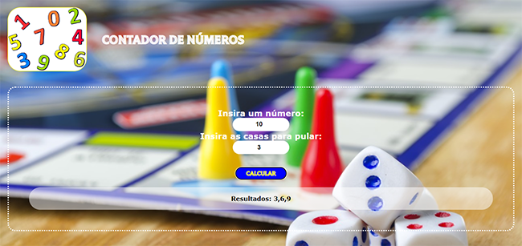

# Contador - Desafio 2 JavaScript - Curso em vídeo #

*Este projeto basea-se na solução de receber um determinado número do usuário junto a quantidade de número que deseja pular até atingir o número máximo*.

*O desafio faz parte da formação JavaScript do [Curso em Vídeo](https://cursoemvideo.com/curso/javascript) apresentado pelo professor [Gustavo Guanabara](https://github.com/gustavoguanabara)*. 

# #

## 🧰Tecnologias Desenvolvidas ##
- [JavaScript](https://developer.mozilla.org/pt-BR/docs/Learn/JavaScript/First_steps/What_is_JavaScript)
- [HTML](https://developer.mozilla.org/pt-BR/docs/Learn/Getting_started_with_the_web/HTML_basics)
- [CSS](https://developer.mozilla.org/pt-BR/docs/Glossary/CSS)

# #
### Minhas Redes Sociais ###

  
